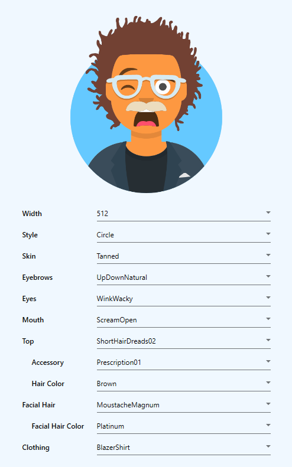

# AvataaarsNet - DEMO

This is a working demo for the [AvataaarsNet WPF Controller](https://github.com/informagico/avataaarsnet)

## Compile

To properly run the demo you can refer to the [Releases](https://github.com/informagico/avataaarsnet-demo/releases) tab (that version uses https://avataaars.io/ endpoint) or you can compile it yourself by adding a reference to this project: [AvataaarsNet](https://github.com/informagico/avataaarsnet).

In any case you can also compile the .dll file from the linked repository (adjusting the endpoint if needed) and then adding that to the resources.

## Note

In this demo I use [MaterialDesignInXAML](https://github.com/MaterialDesignInXAML) for a better UI
